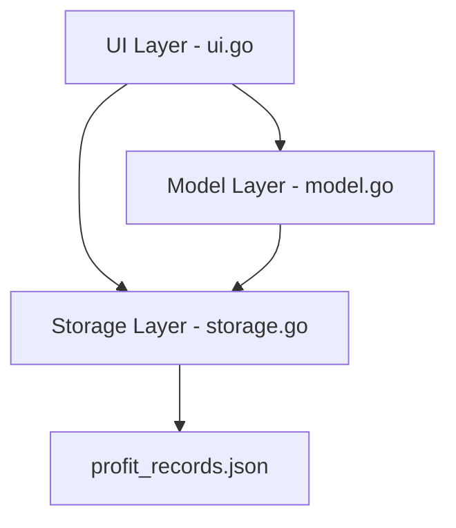
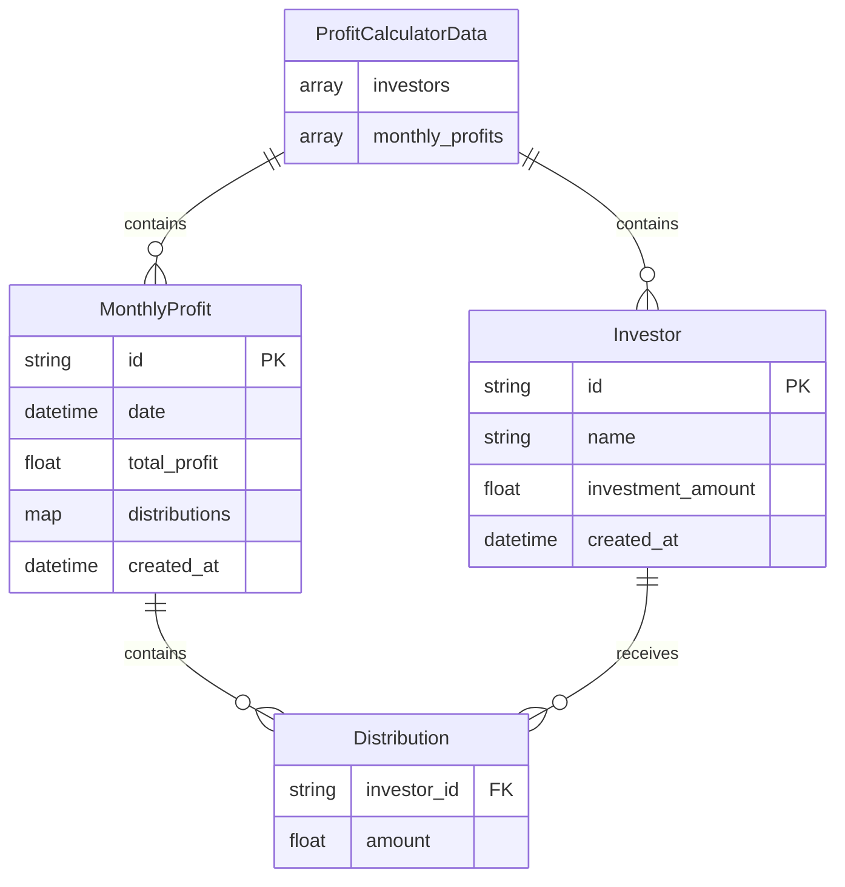
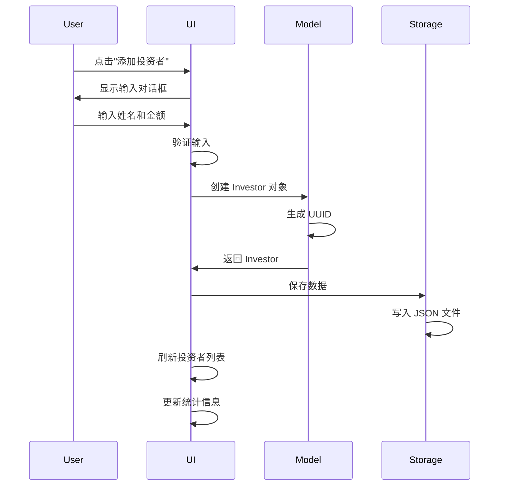
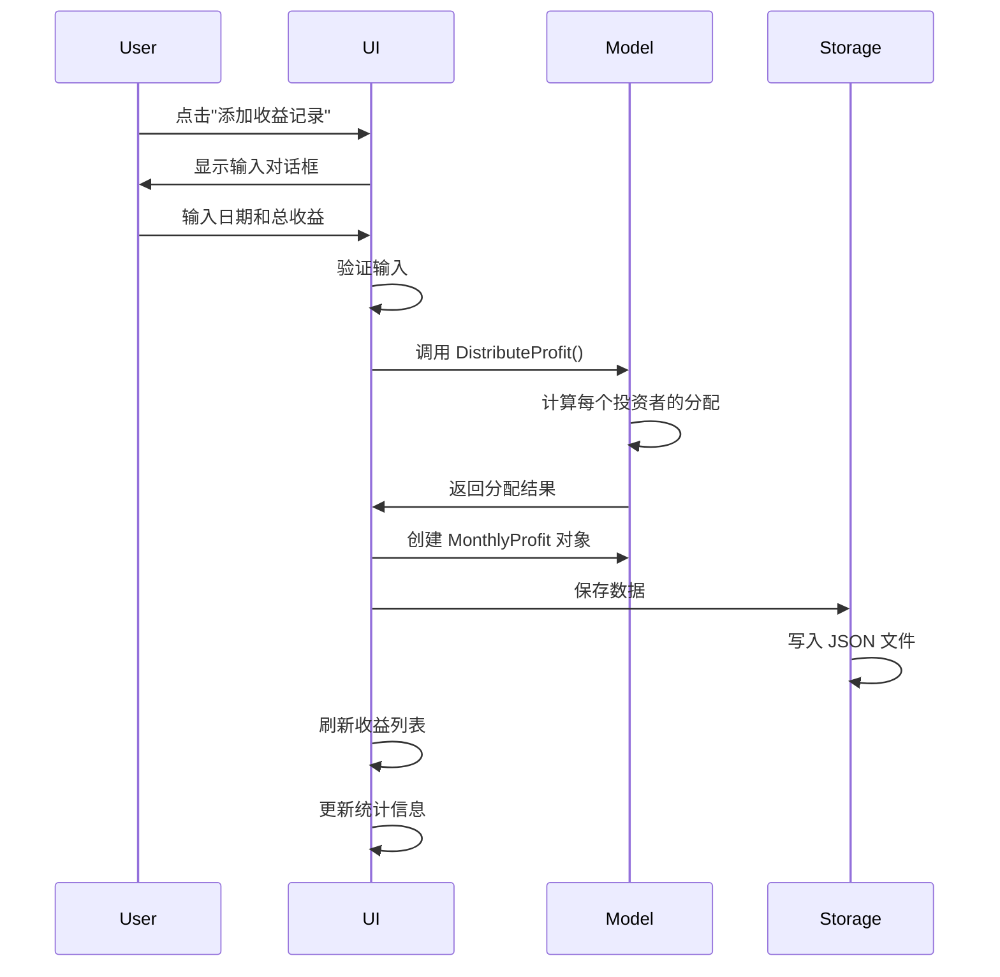

# 设计文档

## 概述

收益计算器是一个多投资者收益分配管理系统，允许用户跟踪多个投资者的投资金额，录入月度收益，并自动按投资比例计算每个投资者的收益分配。系统采用与现有体重记录功能相似的架构模式，使用 Fyne UI 框架构建图形界面，并通过 JSON 文件进行数据持久化。

## 架构

系统采用三层架构模式，与现有的 weight_tracker 模块保持一致：

```
profit_calculator/
├── model.go      # 数据模型和业务逻辑
├── storage.go    # 数据持久化层
└── ui.go         # 用户界面层
```

### 架构图



## 组件和接口

### 1. 数据模型层 (model.go)

#### Investor 结构体
表示单个投资者的信息：

```go
type Investor struct {
    ID              string    `json:"id"`              // 唯一标识符 (UUID)
    Name            string    `json:"name"`            // 投资者姓名
    InvestmentAmount float64  `json:"investment_amount"` // 投资金额
    CreatedAt       time.Time `json:"created_at"`      // 创建时间
}
```

#### MonthlyProfit 结构体
表示单月的收益记录：

```go
type MonthlyProfit struct {
    ID          string              `json:"id"`           // 唯一标识符 (UUID)
    Date        time.Time           `json:"date"`         // 收益日期
    TotalProfit float64             `json:"total_profit"` // 总收益金额
    Distributions map[string]float64 `json:"distributions"` // 投资者ID -> 分配金额
    CreatedAt   time.Time           `json:"created_at"`   // 创建时间
}
```

#### ProfitCalculatorData 结构体
整体数据容器：

```go
type ProfitCalculatorData struct {
    Investors      []Investor      `json:"investors"`
    MonthlyProfits []MonthlyProfit `json:"monthly_profits"`
}
```

#### 核心业务逻辑函数

```go
// CalculateInvestmentRatio 计算投资比例
func CalculateInvestmentRatio(investor Investor, totalInvestment float64) float64

// CalculateTotalInvestment 计算总投资
func CalculateTotalInvestment(investors []Investor) float64

// DistributeProfit 分配收益给所有投资者
func DistributeProfit(totalProfit float64, investors []Investor) map[string]float64

// CalculateInvestorStats 计算单个投资者的统计信息
func CalculateInvestorStats(investorID string, investors []Investor, profits []MonthlyProfit) InvestorStats

// CalculateOverallStats 计算整体统计信息
func CalculateOverallStats(data *ProfitCalculatorData) OverallStats
```

#### InvestorStats 结构体
投资者统计信息：

```go
type InvestorStats struct {
    InvestorID       string
    InvestorName     string
    InvestmentAmount float64
    InvestmentRatio  float64  // 投资比例 (0-1)
    TotalProfit      float64  // 累计收益
    FinalAmount      float64  // 最终金额 (投资 + 收益)
    ProfitCount      int      // 收益记录数
}
```

#### OverallStats 结构体
整体统计信息：

```go
type OverallStats struct {
    TotalInvestment   float64
    TotalProfit       float64
    InvestorCount     int
    ProfitRecordCount int
}
```

### 2. 存储层 (storage.go)

#### Storage 接口

```go
type Storage interface {
    Load() (*ProfitCalculatorData, error)
    Save(data *ProfitCalculatorData) error
}
```

#### JSONStorage 实现

```go
type JSONStorage struct {
    filepath string
}

func NewJSONStorage(filepath string) *JSONStorage
func (s *JSONStorage) Load() (*ProfitCalculatorData, error)
func (s *JSONStorage) Save(data *ProfitCalculatorData) error
```

存储文件：`profit_records.json`

### 3. UI 层 (ui.go)

#### ProfitCalculatorUI 结构体

```go
type ProfitCalculatorUI struct {
    storage         Storage
    data            *ProfitCalculatorData
    window          fyne.Window
    
    // UI 组件
    mainContent     *fyne.Container
    investorList    *widget.List
    profitList      *widget.List
    
    // 统计显示组件
    totalInvestmentText *canvas.Text
    totalProfitText     *canvas.Text
    investorCountText   *canvas.Text
}
```

#### UI 布局结构

```
┌─────────────────────────────────────┐
│         整体统计卡片                  │
│  总投资 | 总收益 | 投资者数量          │
└─────────────────────────────────────┘
┌─────────────────────────────────────┐
│         投资者管理区域                │
│  [添加投资者] 按钮                    │
│  投资者列表 (姓名、金额、比例、操作)   │
└─────────────────────────────────────┘
┌─────────────────────────────────────┐
│         月度收益录入区域              │
│  [添加收益记录] 按钮                  │
│  收益历史列表 (日期、金额、分配明细)   │
└─────────────────────────────────────┘
```

#### 主要 UI 方法

```go
func NewProfitCalculatorUI(window fyne.Window) *ProfitCalculatorUI
func (ui *ProfitCalculatorUI) MakeUI() fyne.CanvasObject

// 统计卡片
func (ui *ProfitCalculatorUI) createStatsCard() fyne.CanvasObject
func (ui *ProfitCalculatorUI) updateStats()

// 投资者管理
func (ui *ProfitCalculatorUI) createInvestorSection() fyne.CanvasObject
func (ui *ProfitCalculatorUI) showAddInvestorDialog()
func (ui *ProfitCalculatorUI) showEditInvestorDialog(investor *Investor)
func (ui *ProfitCalculatorUI) deleteInvestor(investorID string)
func (ui *ProfitCalculatorUI) createInvestorList()

// 收益管理
func (ui *ProfitCalculatorUI) createProfitSection() fyne.CanvasObject
func (ui *ProfitCalculatorUI) showAddProfitDialog()
func (ui *ProfitCalculatorUI) showProfitDetailDialog(profit *MonthlyProfit)
func (ui *ProfitCalculatorUI) deleteProfitRecord(profitID string)
func (ui *ProfitCalculatorUI) createProfitList()

// 数据操作
func (ui *ProfitCalculatorUI) loadData()
func (ui *ProfitCalculatorUI) saveData()
func (ui *ProfitCalculatorUI) refreshUI()
```

## 数据模型

### 数据关系图



### 数据流程

#### 添加投资者流程



#### 添加收益记录流程



## 错误处理

### 输入验证

1. **投资者姓名验证**
   - 不能为空
   - 长度限制：1-50 字符
   - 不能与现有投资者重名

2. **投资金额验证**
   - 必须大于 0
   - 合理范围：0.01 - 10,000,000
   - 保留两位小数

3. **收益金额验证**
   - 可以为负数（亏损）
   - 合理范围：-10,000,000 - 10,000,000
   - 保留两位小数

4. **日期验证**
   - 不能为未来日期
   - 格式：YYYY-MM-DD

### 错误类型

```go
var (
    ErrInvalidInvestorName   = errors.New("投资者姓名无效")
    ErrDuplicateInvestorName = errors.New("投资者姓名已存在")
    ErrInvalidAmount         = errors.New("金额无效")
    ErrNoInvestors           = errors.New("没有投资者，无法分配收益")
    ErrStorageLoad           = errors.New("加载数据失败")
    ErrStorageSave           = errors.New("保存数据失败")
)
```

### 错误处理策略

1. **存储错误**：显示错误对话框，保持当前数据不变
2. **验证错误**：显示错误提示，允许用户修正输入
3. **计算错误**：记录日志，使用默认值或跳过操作
4. **UI 错误**：优雅降级，显示简化界面

## 测试策略

### 单元测试

#### Model 层测试 (model_test.go)

```go
// 测试投资比例计算
func TestCalculateInvestmentRatio(t *testing.T)

// 测试总投资计算
func TestCalculateTotalInvestment(t *testing.T)

// 测试收益分配
func TestDistributeProfit(t *testing.T)

// 测试投资者统计
func TestCalculateInvestorStats(t *testing.T)

// 测试整体统计
func TestCalculateOverallStats(t *testing.T)

// 边界情况测试
func TestDistributeProfitWithZeroInvestment(t *testing.T)
func TestDistributeProfitWithNoInvestors(t *testing.T)
```

#### Storage 层测试 (storage_test.go)

```go
// 测试保存和加载
func TestJSONStorageSaveAndLoad(t *testing.T)

// 测试空文件加载
func TestJSONStorageLoadEmpty(t *testing.T)

// 测试文件不存在
func TestJSONStorageLoadNonExistent(t *testing.T)

// 测试无效 JSON
func TestJSONStorageLoadInvalidJSON(t *testing.T)
```

### 集成测试

1. **完整工作流测试**
   - 添加多个投资者
   - 录入多条收益记录
   - 验证统计数据正确性
   - 验证数据持久化

2. **UI 交互测试**
   - 对话框显示和关闭
   - 列表刷新
   - 统计更新

### 测试数据

```go
var testInvestors = []Investor{
    {ID: "1", Name: "张三", InvestmentAmount: 100000},
    {ID: "2", Name: "李四", InvestmentAmount: 150000},
    {ID: "3", Name: "王五", InvestmentAmount: 50000},
}

var testProfit = MonthlyProfit{
    ID: "p1",
    Date: time.Now(),
    TotalProfit: 30000,
}

// 预期分配结果：
// 张三: 10000 (33.33%)
// 李四: 15000 (50%)
// 王五: 5000 (16.67%)
```

## UI 设计细节

### 颜色方案

- **主色调**：蓝色 (#2196F3) - 用于标题和重要信息
- **成功色**：绿色 (#4CAF50) - 用于正收益
- **警告色**：橙色 (#FF9800) - 用于提示
- **错误色**：红色 (#F44336) - 用于负收益和错误
- **中性色**：灰色 (#9E9E9E) - 用于次要信息

### 图标使用

- 投资者：`theme.AccountIcon()`
- 添加：`theme.ContentAddIcon()`
- 编辑：`theme.DocumentCreateIcon()`
- 删除：`theme.DeleteIcon()`
- 收益：`theme.ConfirmIcon()`
- 统计：`theme.InfoIcon()`

### 响应式布局

- 最小窗口宽度：600px
- 最小窗口高度：700px
- 列表项高度：自适应内容
- 卡片间距：10px

## 性能考虑

1. **数据加载**：应用启动时异步加载数据
2. **列表渲染**：使用 Fyne 的虚拟列表，支持大量数据
3. **计算优化**：缓存统计结果，仅在数据变化时重新计算
4. **文件 I/O**：使用缓冲写入，减少磁盘操作

## 扩展性

### 未来可能的功能

1. **导出功能**：导出为 Excel 或 PDF 报表
2. **图表展示**：收益趋势图、投资占比饼图
3. **多项目支持**：管理多个投资项目
4. **提醒功能**：收益录入提醒
5. **备份恢复**：数据备份和恢复功能
6. **权限管理**：不同用户角色的访问控制

### 代码扩展点

```go
// 可扩展的存储接口
type Storage interface {
    Load() (*ProfitCalculatorData, error)
    Save(data *ProfitCalculatorData) error
    // 未来可添加：
    // Export(format string) error
    // Import(filepath string) error
}

// 可扩展的计算策略
type DistributionStrategy interface {
    Distribute(totalProfit float64, investors []Investor) map[string]float64
}
```

## 集成到主应用

### 修改 main.go

在主应用的标签页中添加收益计算器：

```go
import "my_portfolio/profit_calculator"

// 创建收益计算器 UI
profitCalculatorUI := profit_calculator.NewProfitCalculatorUI(myWindow)
profitCalculatorContent := profitCalculatorUI.MakeUI()

// 添加到标签页
tabs := container.NewAppTabs(
    // ... 现有标签页 ...
    container.NewTabItemWithIcon("收益计算", theme.ConfirmIcon(), profitCalculatorContent),
)
```

### 文件结构

```
my_portfolio/
├── main.go
├── profit_calculator/
│   ├── model.go
│   ├── storage.go
│   └── ui.go
├── weight_tracker/
│   └── ...
├── settings/
│   └── ...
└── profit_records.json  (自动生成)
```
